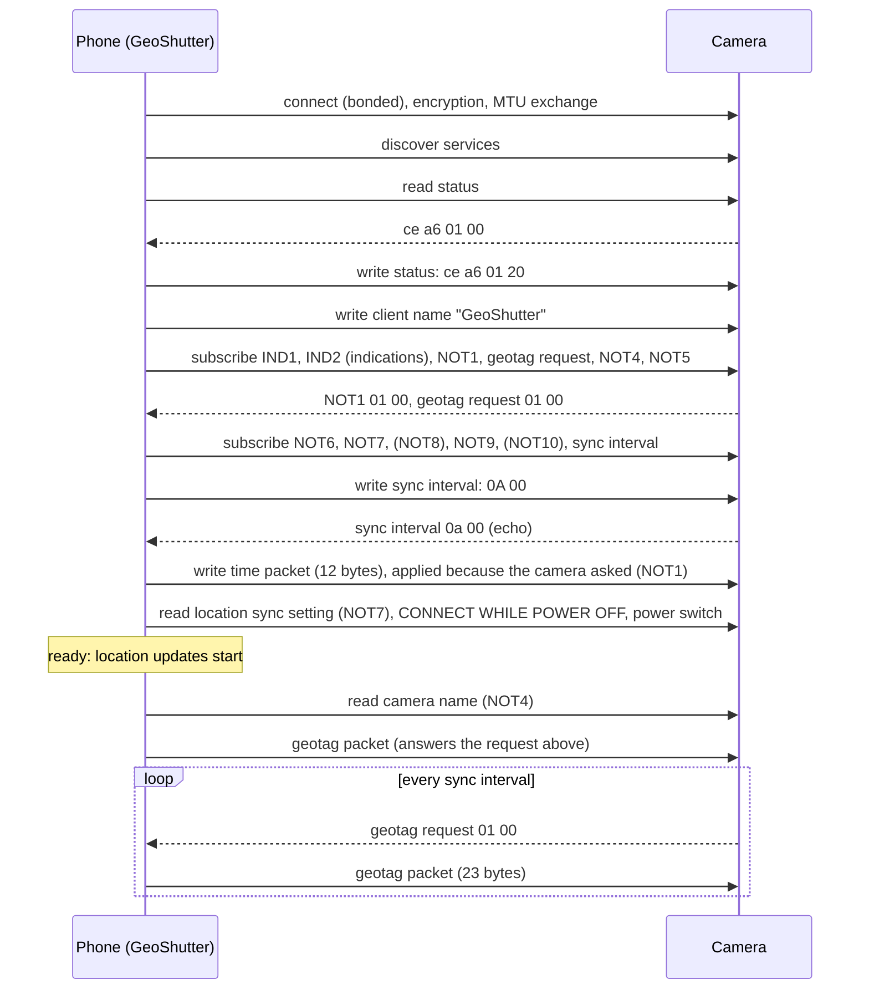

# Fujifilm Bluetooth LE protocol

> **Status: experimental, Android only.** With a FUJIFILM X100VI (firmware 01.32)
> GeoShutter geotags photos, sets the camera's date, time and time zone, reads and changes
> the camera's SMARTPHONE LOCATION SYNC. setting, and keeps the location of a camera that
> is switched off or asleep up to date in standby. iOS and cameras with the legacy protocol are not
> supported.

This is the reference for the Bluetooth Low Energy protocol GeoShutter uses with Fujifilm
cameras: what the camera offers, every message with its bytes, the order and timing, how
the camera behaved in tests, and where each fact comes from. Fujifilm publishes no
protocol documentation.

Rules for changing the protocol code: never guess bytes. Back every UUID, byte and
ordering with a source listed here or an observed camera response, and record the
evidence in this file.

## Contents

1. [Summary](#1-summary)
2. [Sources and evidence](#2-sources-and-evidence)
3. [Names](#3-names)
4. [Advertising](#4-advertising)
5. [Pairing and registration](#5-pairing-and-registration)
6. [GATT database](#6-gatt-database)
7. [Session setup](#7-session-setup)
8. [Messages](#8-messages)
9. [After setup](#9-after-setup)
10. [Camera behavior](#10-camera-behavior)
11. [Implementation in GeoShutter](#11-implementation-in-geoshutter)
12. [Verification status](#12-verification-status)
13. [Known gaps and open questions](#13-known-gaps-and-open-questions)
14. [How to investigate](#14-how-to-investigate)
15. [Credits and license](#credits-and-license)

## 1. Summary

- The phone is the GATT client, the camera the GATT server. Multi-byte values are
  little-endian. Every write is a write with response.
- The camera has to be **bonded** (LE Secure Connections, confirmed on the camera) and
  **registered** (the setup below, run on the pairing connection).
- On every connection the phone runs a short setup: acknowledge the status, write its
  name, subscribe to the camera's notifications, write the sync interval (10 s) and set
  the camera clock (UTC, time zone, daylight saving time).
- **Location is pulled.** The camera sends a geotag request every sync interval; the phone
  answers each with a 23-byte geotag packet. Nothing is pushed.
- The camera's clock and AREA SETTING come from a separate 12-byte time packet, not from
  the geotag packet. The camera applies it only when it has asked for it: on the first
  connection after it is switched on or wakes up.
- A camera switched off or asleep with CONNECT WHILE POWER OFF on stays connected in
  standby, reports that through its power switch value, and keeps asking for locations.

The characteristics GeoShutter uses:

| Purpose | Service | Characteristic | GeoShutter | Value |
|---|---|---|---|---|
| Status | `123d8f06-62a1-4935-9322-833c531ee225` | `f557d96b-8284-4667-8793-b971c1deca2a` | read, write | 4 bytes |
| Client name | `123d8f06-…` | `85b9163e-62d1-49ff-a6f5-054b4630d4a1` | write | UTF-8 |
| IND1, IND2 | `4c0020fe-f3b6-40de-acc9-77d129067b14` | `a68e3f66-0fcc-4395-8d4c-aa980b5877fa`, `bd17ba04-b76b-4892-a545-b73ba1f74dae` | indications | not interpreted |
| Date sync state (NOT1) | `4c0020fe-…` | `f9150137-5d40-4801-a8dc-f7fc5b01da50` | notifications | `01 00` |
| Geotag request | `4c0020fe-…` | `ad06c7b7-f41a-46f4-a29a-712055319122` | notifications | `01 00` |
| NOT6 | `4c0020fe-…` | `e6692c5c-b7cd-44f4-95fc-eda07ce32560` | notifications | not interpreted |
| Camera name (NOT4) | `4e941240-d01d-46b9-a5ea-67636806830b` | `bf6dc9cf-3606-4ec9-a4c8-d77576e93ea4` | notifications, read | ASCII |
| NOT5 | `4e941240-…` | `75823784-fbb7-4b71-abae-cd9a34072e3c` | notifications | not interpreted |
| Location sync setting (NOT7) | `4e941240-…` | `aab609c4-94dd-4d89-bc60-665d5090b828` | notifications, read, write | uint16, 0 or 1 |
| NOT8, NOT9, NOT10 | `4e941240-…` | `2a125640-706d-4dd1-b420-c0f4ab93c361`, `82a9f452-c5ce-4ef5-8203-3fc9a47f8171`, `deef7187-3f43-4364-9e22-11a8c8a15951` | notifications (optional) | not interpreted |
| Sync interval | `4e941240-…` | `c95d91ae-b247-4d6d-8661-7dd5d6a0f85b` | notifications, write | uint16, seconds |
| Geotag packet | `3b46ec2b-48ba-41fd-b1b8-ed860b60d22b` | `0f36ec14-29e5-411a-a1b6-64ee8383f090` | write | 23 bytes |
| Time packet | `e872b11f-d526-4ae1-9bb4-89a99d48fa59` | `c52edbce-1fe2-4ecc-9483-907e6592be9e` | write | 12 bytes |
| Power switch | `804daa8e-ffeb-4ab3-8e75-6edd7303208d` | `f90f7d3a-3b64-45c6-ab21-933900184837` | read | uint16 |
| CONNECT WHILE POWER OFF | `804daa8e-…` | `7170fd5a-56d9-4c19-b043-7a7047d8e1a0` | read, write | uint16, 0 or 1 |

## 2. Sources and evidence

Facts in this document are tagged with where they come from:

| Tag | Source |
|---|---|
| **F** | [furble](https://github.com/gkoh/furble) (MIT), which reverse-engineered the protocol from HCI snoop logs of Fujifilm's app. References are to commit [`0cac22a`](https://github.com/gkoh/furble/tree/0cac22aacc3d9ef250be40849118af78a5f39f27) unless noted. |
| **A** | Static analysis of FUJIFILM XApp for Android, versions 1.0.3 and 2.7.6(1), by the maintainer (2026-09-29: a time and location report, a technical reference of all 75 characteristics and a machine-readable catalog), plus a separate research pass on 2.7.6 (all decompiled with JADX 1.5.6). The reports are kept outside this repository. Only formats, names and behavior were taken; no code was copied. |
| **T** | [tiredboffin/fffw](https://github.com/tiredboffin/fffw): GATT tables extracted from camera firmware (X100VI: `ffbt/cfg/gatt-ad14d4.yaml`). |
| **M** | Fujifilm manuals and release notes. |
| **X** | Observed with GeoShutter debug builds on a Samsung Galaxy SM-F976B (Android 17) and an X100VI (firmware 01.32), 2026-09-28 and 2026-09-29, from the Android Bluetooth stack's log and GeoShutter's log. No HCI capture exists (see [How to investigate](#14-how-to-investigate)). Addresses, serial numbers and other identifiers are left out. |

Specific references:

| Topic | Reference |
|---|---|
| Company ID `0x04D8`, service and characteristic UUIDs | F: `Fujifilm.h:35-99`, `FujifilmSecure.h:71-100`, `FujifilmSecure.cpp:13-14`, `FujifilmBasic.cpp:12-13` |
| Secure setup (firmware from about July 2025) | F: `FujifilmSecure.cpp:73-213` (`_connect`) |
| Advertisement matching | F: `Fujifilm.cpp:57-66`, `FujifilmSecure.cpp:19-23` and `55-66`, `FujifilmBasic.cpp` `matches()` |
| Notifications `01 00`, `02 00` | F: `Fujifilm.cpp:17-35` |
| Geotag packet | F: `Fujifilm.h:72-92` (packed struct), `Fujifilm.cpp:93-130`; A: the packet serializer of both app versions |
| UTC time in the geotag packet | F: `FurbleGPS.cpp:160-186` (time from the GPS receiver's NMEA sentences); A |
| No accuracy or satellite fields in the geotag packet | F: [MaxRink/furble#47](https://github.com/MaxRink/furble/pull/47) |
| The camera ignores a geotag packet whose time isn't newer than the last one | F: [gkoh/furble#43](https://github.com/gkoh/furble/issues/43#issuecomment-1451368526) (a user's observation) |
| The camera ignores locations older than three hours | M: [FUJIFILM Camera Remote guide](https://app.fujifilm-dsc.com/en/camera_remote/guide02.html) |
| Time service `e872b11f-…` with `c52edbce-…` | F: a comment "may need to send time sync message? SVC: e872b11f… CHR: c52edbce…", added from a capture of Fujifilm's app and later removed (`FujifilmSecure.cpp:135-137` at `4dc076a`); T: write-only, 7 and 12 bytes; A |
| Time packet layout, triggers; location sync setting; interval choices; characteristic names | A |
| Newer cameras notify `01 00` on NOT1 right after it is subscribed | F: [gkoh/furble#208](https://github.com/gkoh/furble/issues/208#issuecomment-3248202516) (X-E5, GFX100RF logs); X |
| AREA SETTING follows the phone's time sync | M: [XApp 2.0.3 notice](https://www.fujifilm-x.com/global/news/fujifilm-xapp-ios-android-ver-2-0-3-release/), [X100VI firmware 1.10 notes](https://www.fujifilm-x.com/global/support/download/firmware/cameras/x100vi/) |
| Menu settings (SMARTPHONE LOCATION SYNC., NAME, CONNECT WHILE POWER OFF, AREA SETTING, TIME DIFFERENCE) | M: X100VI manual, [network/USB settings](https://fujifilm-dsc.com/en/manual/x100vi/connections/network_usb_menu/) and [user settings](https://fujifilm-dsc.com/en/manual/x100vi/menu_setup/user_setting/) |

The furble UUIDs in `FujifilmBluetoothConstants.kt` were checked by parsing every
`NimBLEUUID{…}` constructor in the furble files above; the time service UUIDs were checked
against the app analysis (A) and fffw (T).

## 3. Names

furble numbers the notification characteristics (IND1, IND2, NOT1 to NOT10); Fujifilm's
app names them (A, without its `CHARACTERISTIC_FF_` prefix). This document uses furble's
numbers where they exist.

| Characteristic | furble | Fujifilm's app | Meaning |
|---|---|---|---|
| `f557d96b` | status | `CONNECTED_DEVICE_IDENTIFICATION_NUMBER` | read and acknowledged during setup |
| `85b9163e` | identifier | `CONNECTED_DEVICE_NAME_STRING` | the phone's name |
| `a68e3f66` | IND1 | `AP_STATE` | not interpreted |
| `bd17ba04` | IND2 | `TRANSFER_STATE` | not interpreted |
| `f9150137` | NOT1 | `DATE_SYNC_STATE` | Fujifilm's app sends the time on every change |
| `ad06c7b7` | geotag request | `LOCATION_SYNC_STATE` | the camera asks for a location |
| `e6692c5c` | NOT6 | `CAMERA_VITAL_STATE` | not interpreted |
| `bf6dc9cf` | NOT4 | `CAMERA_SSID_NAME_STRING` | the camera's name |
| `75823784` | NOT5 | `LOGGING_SETTING` | not interpreted |
| `aab609c4` | NOT7 | `LOCATION_SYNC_SETTING` | SMARTPHONE LOCATION SYNC. |
| `82a9f452` | NOT9 | `IMAGE_RESIZE_SETTING` | not interpreted |
| `2a125640`, `deef7187` | NOT8, NOT10 | not identified | absent on the X100VI |
| `c95d91ae` | geotag sync interval | `LOCATION_SYNC_CYCLE` | seconds between geotag requests |
| `0f36ec14` | geotag | `LOCATION_AND_SPEED` | the geotag packet |
| `c52edbce` | (comment only) | `UTC_AND_TIMEZONE` | the time packet |
| `b9bfd37f` | none | `DATE_TIME` | local date and time (not used) |
| `f90f7d3a` | none | `CAMERA_POWER_KEY_STATE` | the power switch position |
| `7170fd5a` | none | `REMOTE_BOOT_SETTING` | CONNECT WHILE POWER OFF |
| `049ec406`, `2f6cb772`, `11438c83`, `4b3a413c` | none | `FWUPDATE_STATE`, `LOG_TRANSFER_STATE`, `BACKUP_STATE`, `RESTORE_STATE` | not used |
| `caedb497`, `98934b2c`, `bd45f887` | none | `IMAGE_TRANSFER_SETTING`, `IMAGE_TRANSFER_SETTING_EX`, `SETTING_RESERVATION_AFTER_SHOOTING` | not used |

Services: `4c0020fe` is the app's `SERVICE_FF_CAMERA_STATE` (furble: configuration),
`4e941240` its `SERVICE_FF_CAMERA_SETTING` (furble: notifications), `3b46ec2b`
`SERVICE_FF_CURRENT_LOCATION` and `e872b11f` `SERVICE_FF_CURRENT_TIME` (A). The X100VI
uses the app's newer ("RED") service layout: `123d8f06` is `CONNECTED_DEVICE_INFORMATION_RED`,
`a9d2b304` `CAMERA_INFORMATION_RED` and `804daa8e` `CAMERA_STARTUP_INFORMATION_RED`; older
cameras use `91f1de68`, `117c4142` and `731893f9-744e-4899-b7e3-174106ff2b82` instead (A).

Characteristics of Fujifilm's app that GeoShutter doesn't use but that matter for this
protocol (A; not checked on the camera):

| Characteristic | Name | Format |
|---|---|---|
| `8b5ecf55-fc6b-40d0-b4c1-76f64e5453c7` | `CONNECTED_APPLICATION_INFORMATION` | 3 bytes, written during setup: application `80`, protocol version `01 01` |
| `7ede1988-b27e-43fc-80f4-6fec994f0552` | `CONNECTED_DEVICE_DISCONNECTED_REASON` | uint16 written before disconnecting: 0 none, 1 user stop, 2 timeout |
| `43070f6c-51e0-4887-86a7-5f762bda5791` | `POWER_CONTROL_REQUEST` | uint16: 1 power off, `0x0100` normal boot (wake) |

The complete list is in the analysis (A).

In GeoShutter's code the geotag request is `GEOTAG_REQUEST_UUID`, the sync interval
`GEOTAG_SYNC_INTERVAL_UUID`, NOT7 also `LOCATION_SYNC_SETTING_UUID` and the time packet's
characteristic `UTC_TIME_ZONE_UUID`.

## 4. Advertising

- Manufacturer data starts with the company ID `0x04D8` (F, X).
- **Secure firmware:** after the company ID, the type byte `01` and the camera serial
  number as 5 ASCII characters (F, A, X). In PAIRING REGISTRATION the X100VI advertises as
  `X100VI` from a random resolvable address with service
  `a9d2b304-e8d6-4902-8336-352b772d7597` (X). Before its first registration it also
  advertised as `X100VI-` plus four serial characters, from a public address, with service
  `804daa8e-…` and 7 bytes (`01`, serial, `00`) (X).
- furble treats a camera advertising `a9d2b304-…` as a new camera to pair, and recognizes
  a paired camera by service `123d8f06-…` plus a matching serial (F).
- **Legacy firmware:** type `02` and a 4-byte pairing token, services
  `af854c2e-b214-458e-97e2-912c4ecf2cb8` or `117c4142-edd4-4c77-8696-dd18eebb770a` (F, A).
- A registered X100VI advertises only briefly after it is switched on (about 6 to 10 s),
  stops while it is connected, and stops about 30 s after losing a connection (X; see
  [Camera behavior](#10-camera-behavior)).
- GeoShutter's companion-device chooser (`DeviceAssociationUtils.kt`) filters on the
  company ID only, so secure and legacy cameras are listed.

## 5. Pairing and registration

**Bond (X).** LE Secure Connections with numeric comparison (Android pairing variant 2).
The camera shows a six-digit code, which has to be confirmed with MENU/OK within 30 s,
otherwise the phone gives up (`SMP_RSP_TIMEOUT`). Android confirms by itself for
companion-associated devices, so the phone shows no code. The bond maps the pairing
address to the camera's identity address; later connections and companion presence
detection resolve the camera's changing addresses.

**Registration (X).** The first bond was made without running the setup on the pairing
connection. The camera then refused every setup for about four and a half minutes,
presumably until its pairing screen ended: the status read returned `xx 8a 01 00` or
`xx 8a 21 00` (a different first byte each time), and the camera dropped the link (reason
`0x13`) about 160 ms after the acknowledgement `xx 8a 01 20`. From then on the status read
`0c 01 00 00` and the whole setup was accepted. furble and Fujifilm's app run the setup on
the pairing connection itself (F, A). GeoShutter does the same for a camera the chooser
saw as Fujifilm (Android 14 and later): it connects right after bonding. With a fresh
pairing on 2026-09-29 (camera and phone pairings deleted first) the bond completed at
11:29:42.440, GeoShutter connected 30 ms later, the status read `fc b1 21 00` was
acknowledged with `fc b1 21 20`, and the whole setup was accepted 2.3 s after connecting,
while the camera was still in pairing registration; geotag requests followed every 10 s.

**New address per pairing (X).** Every pairing registration gave the camera a new identity
address (three pairings, three addresses) and a new status value (`0c 01 00 00`,
`ce a6 01 00`, `fc b1 21 00`). FUJIFILM XApp on the same phone shares the phone's bond:
after XApp paired with the camera, the camera had to be added to GeoShutter again.

## 6. GATT database

X100VI, firmware 01.32 (X, from service discovery). Properties: R read, W write, N notify,
I indicate.

| Service | Characteristics |
|---|---|
| `1800` Generic Access | `2A00` device name (R): only the model, "X100VI"; `2A01` appearance (R) |
| `1801` Generic Attribute | `2A05` service changed (R, I) |
| `180A` Device Information | `2A29` manufacturer, `2A24` model (FF230003), `2A25` serial, `2A27` hardware, `2A26` firmware (01.32), `2A28` software (01.81), all R |
| `a9d2b304-…` | seven characteristics (R), unknown |
| `15ca59fe-…` | three characteristics (R), unknown |
| `123d8f06-…` pairing | `85b9163e` client name (W), `f557d96b` status (R, W), `aba356eb` legacy pairing key (W; used by legacy firmware), four more, unknown |
| `4e941240-…` camera setting | NOT4 `bf6dc9cf`, NOT5 `75823784`, NOT7 `aab609c4`, NOT9 `82a9f452`, sync interval `c95d91ae`, `98934b2c`, `bd45f887`, `caedb497` (all R, W, N); two more (R) |
| `4c0020fe-…` camera state | IND1 `a68e3f66`, IND2 `bd17ba04`, `049ec406`, `2f6cb772`, `11438c83`, `4b3a413c` (R, I); NOT1 `f9150137`, geotag request `ad06c7b7`, NOT6 `e6692c5c` (R, N); three more (R) |
| `3b46ec2b-…` current location | `0f36ec14` geotag packet (W) |
| `e872b11f-…` current time | `c52edbce` time packet (W, 12 bytes; the X100VI accepted it), `b9bfd37f` local date and time (W, 7 bytes). Sizes, and `b9bfd37f` itself, from T |
| `6514eb81-…` shutter | `7fcf49c6` shutter and eight more (W) |
| `804daa8e-…` camera startup information | `f90f7d3a` power switch (R), `7170fd5a` CONNECT WHILE POWER OFF (R, W), further characteristics not used |
| `af854c2e-…`, `fcc1` | further write-only and read/write characteristics, not used |

NOT8 (`2a125640-…`) and NOT10 (`deef7187-…`) do not exist on the X100VI. furble lists them
as optional (F), and GeoShutter skips them.

The X100VI answered Android's MTU request (517) with 255, and the data length grew to 251
bytes (X), so every message fits in a single write.

## 7. Session setup

GeoShutter runs this on every connection, one operation at a time (X):



| Step | Operation | Characteristic | Value (example) | Notes |
|---|---|---|---|---|
| 0 | connect, encrypt | | | bonded cameras only |
| 1 | discover services | | | then detection, below |
| 2 | read | status | `ce a6 01 00` | 4 bytes |
| 3 | write | status | `ce a6 01 20` | bytes 0–2 unchanged, byte 3 = `20` |
| 4 | write | client name | `47 65 6F 53 68 75 74 74 65 72` ("GeoShutter") | |
| 5–10 | subscribe | IND1, IND2 (indications, CCCD `02 00`); NOT1, geotag request, NOT4, NOT5 (notifications, CCCD `01 00`) | | required, in this order |
| 11–16 | subscribe | NOT6, NOT7, NOT8, NOT9, NOT10, sync interval (notifications) | | failures skipped, except the sync interval |
| 17 | write | sync interval | `0A 00` (10 s, the default) | the camera's *Location updates while on* setting; the camera echoes it as a notification |
| 18 | write | time packet | `EA 07 09 1C 16 24 37 64 00 00 00 01` | only with the option *Set date, time and time zone* on and the characteristic present; applied only if the camera asked (NOT1) |
| 19 | read | location sync setting (NOT7) | `01 00` | `00 00`: shown as "Location sync off"; the phone's location isn't used for this camera |
| 20 | read | CONNECT WHILE POWER OFF | `01 00` | shown in the camera details |
| 21 | read | power switch | `01 02` awake; `00 01` switched off, `01 01` asleep, both in standby | standby: shown as "Standby" (blue) |
| | ready | | | location updates start, as often as the most demanding camera needs; geotag requests are answered |
| 22 | read | camera name (NOT4) | "FUJIFILM-X100VI-" and four characters | stored for the camera list |

Steps 2 to 17 follow furble's `_connect` (F); step 18 is where Fujifilm's app sets the
clock (A); steps 19 to 21 let GeoShutter know the camera's state before it counts as
ready, so nothing is shown or started that doesn't apply. In a working connection the camera notifies NOT1 `01 00` and the geotag request
`01 00` as soon as they are subscribed (X). A geotag request that arrives during setup is
answered once the camera is ready and a location fix exists.

**Detection** (after step 1): the Sony location characteristic `DD11` means a Sony camera
(checked first, so Sony cameras keep their path); the status characteristic `f557d96b`
means a Fujifilm camera with the secure protocol; the legacy pairing characteristic
`aba356eb-9633-4e60-b73f-f52516dbd671` means the legacy protocol, which ends the session
with an error; anything else takes the Sony path.

**Timing (X).** Connection to ready took about 1.6 to 2 s, and the first geotag answer
followed about 1 s later, once the phone had a location fix.

**Failures.** Every operation waits for its result (15 s timeout, service discovery 30 s).
An authentication error, which on a reconnect usually means encryption is still being set
up, repeats the same operation up to three times (first retry immediately, then after 3 s);
if it persists, the app shows its "Pairing Failed" dialog. Any other failure of a required
step ends the setup with an error. A failed optional subscription is skipped: NOT8 and NOT10
don't exist on the X100VI.

**Fujifilm's app (A)** requests an MTU of 185 before discovering services and subscribes in
two phases. Version 2.7.6 enables indications when a characteristic supports them and
notifications otherwise (1.0.3 used notifications for NOT1 and the geotag request and
indications for everything else). When
the registration of notifications finishes, it writes the sync interval and then the time.

## 8. Messages

### 8.1 Status and acknowledgement

`f557d96b` in the pairing service (F, A, X). Read 4 bytes; write them back with the fourth
byte set to `20`.

| Read | Written | Where |
|---|---|---|
| `07 96 00 00` | `07 96 00 20` | furble's example (F) |
| `0c 01 00 00` | `0c 01 00 20` | X100VI after its first registration (X) |
| `ce a6 01 00` | `ce a6 01 20` | X100VI after re-pairing with XApp, 2026-09-29 (X) |
| `fc b1 21 00` | `fc b1 21 20` | X100VI on the pairing connection of a fresh pairing, 2026-09-29 (X) |
| `xx 8a 01 00`, `xx 8a 21 00` | `xx 8a 01 20` | unregistered X100VI: the camera dropped the link (X) |

Fujifilm's app calls it the connected device's identification number (A). It reads the
value as a uint32, combines the first value it ever reads with `0x20000000` (the `20` in
the fourth byte), stores it and writes that stored value back on every later connection
(A). GeoShutter reads and acknowledges on every connection, which gives the same bytes as
long as the camera returns the same value; it did for each registration (X).

### 8.2 Client name

`85b9163e` in the pairing service: the phone's name as UTF-8, written with response (F).
furble writes `furble-` and an ID; GeoShutter writes `GeoShutter`. Fujifilm's app adds a
`00` byte after the name (A); the X100VI accepts the name without it (X). The same UUID also
exists in the legacy pairing service `91f1de68-dff6-466e-8b65-ff13b0f16fb8`, so GeoShutter
looks it up in `123d8f06-…`. Whether the camera shows this name anywhere was not checked.

### 8.3 Sync interval

`c95d91ae`: seconds between geotag requests, uint16 (F, A). GeoShutter subscribes to it
first, as furble requires, and writes the camera's *Location updates while on* setting
(default `0A 00`, 10 s) during setup and again at once when it is changed while the camera
is connected; the X100VI echoes the value as a notification and then asks at that
interval (X: `14 00` written at 12:43:40 on 2026-09-29, then requests at 12:43:45,
12:44:05 and 12:44:25). The phone's location updates follow the most demanding camera
(9). The choices, the same as in Fujifilm's app (A):

| Seconds | 10 | 15 | 20 | 30 | 60 | 120 | 240 | 480 |
|---|---|---|---|---|---|---|---|---|
| Bytes | `0A 00` | `0F 00` | `14 00` | `1E 00` | `3C 00` | `78 00` | `F0 00` | `E0 01` |

### 8.4 Geotag request

`ad06c7b7`, notification `01 00`: "send a location" (F, X). furble compares the first two
bytes; Fujifilm's app sends a location on any change of this characteristic (A). The phone
answers with one geotag packet per request.

### 8.5 Geotag packet

`0f36ec14` in `3b46ec2b-…`, 23 bytes, written with response (F, A, X):

| Offset | Size | Type | Content | GeoShutter | Fujifilm's app (A) |
|---|---|---|---|---|---|
| 0 | 4 | int32 | latitude × 10⁷ | truncated toward zero, like furble | rounded |
| 4 | 4 | int32 | longitude × 10⁷ | truncated | rounded |
| 8 | 4 | int32 | altitude, whole metres | above mean sea level where Android provides it (Android 14 and later), otherwise the WGS84 altitude; 0 if unknown | Android's WGS84 altitude, rounded |
| 12 | 4 | int32 | speed, m/s × 100 | 0 (furble: padding) | the fix's speed |
| 16 | 2 | uint16 | year (UTC) | time of sending | time of the fix |
| 18 | 5 | 5 × uint8 | month, day, hour, minute, second (UTC) | | |

Example (unit test): 25.2048° N, 55.2708° E, 5 m, 2026-09-28 12:34:56 UTC:

```
80 F2 05 0F  A0 A7 F1 20  05 00 00 00  00 00 00 00  EA 07  09 1C 0C 22 38
latitude     longitude    altitude     speed        year   month day hour minute second
```

- There are no accuracy, satellite or validity fields (F).
- The X100VI accepted every packet and showed the location in playback (X). In the EXIF
  data of a photo the position was within 1 m of the phone and the GPS time was the
  packet's time in UTC (for example 09:09:46 UTC for a photo taken at 11:09:54 local
  time); the photo was taken 2 s after the camera was switched on, before GeoShutter had
  reconnected, and carried the location sent 8 s earlier in standby (X, 2026-09-29).
- The camera does **not** set its clock from this packet: nine answers with the camera
  clock set wrong left it wrong (X).
- Reported elsewhere, not checked: the camera ignores a packet whose time is not newer than
  the last one (F, #43), and locations older than three hours (M). GeoShutter's time of
  sending always increases.

### 8.6 Date sync state (NOT1)

`f9150137`, notifications: the camera asks for the time (A: `DATE_SYNC_STATE`; Fujifilm's
app writes the time again on every change, whatever the value). The X100VI notified
`01 00` right after NOT1 was subscribed on the **first connection after it was switched on
or woke up** (X, 2026-09-29: eight such connections, including one in standby). It did not
notify on connections the phone started while the camera stayed on (twice, after an app
update), nor when NOT1 was subscribed again during a connection. Also seen on an X-E5 and a
GFX100RF right after subscribing (F #208). furble reads `02 00` as "configured" (F); the
X100VI didn't send it in the connections examined. No NOT1 followed a time write (X).

### 8.7 Time packet: date, time and time zone

`c52edbce` in the time service `e872b11f-…`, 12 bytes, written with response (A, T; applied
by the X100VI, X):

| Offset | Size | Type | Content |
|---|---|---|---|
| 0 | 2 | uint16 | year (UTC) |
| 2 | 5 | 5 × uint8 | month, day, hour, minute, second (UTC) |
| 7 | 4 | int32 | standard offset of the phone's time zone from UTC, in hundredths of an hour, without daylight saving time |
| 11 | 1 | uint8 | `01` while daylight saving time is in effect, else `00` |

Example (unit test): 2026-09-29 12:34:56 UTC in a UTC+1:00 zone during daylight saving
time (Oslo, Berlin, Paris in summer):

```
EA 07  09 1D 0C 22 38  64 00 00 00  01
year   month day hour  offset 100   daylight saving
       minute second
```

Offsets:

| Zone | Offset | Bytes 7–10 |
|---|---|---|
| UTC | 0 | `00 00 00 00` |
| UTC+1:00 | 100 | `64 00 00 00` |
| UTC+5:30 (India) | 550 | `26 02 00 00` |
| UTC+5:45 (Nepal) | 575 | `3F 02 00 00` |
| UTC+12:45 (Chatham Islands) | 1275 | `FB 04 00 00` |
| UTC−3:30 (Newfoundland) | −350 | `A2 FE FF FF` |
| UTC−5:00 | −500 | `0C FE FF FF` |
| UTC−9:30 (Marquesas) | −950 | `4A FC FF FF` |

- Daylight saving time has its own flag: never add it to the offset as well.
- The phone's zone is used, not one derived from the location (A: the app does the same).
- A zone whose daylight saving time is negative in the tz database (Europe/Dublin in
  winter) is sent as its current offset with the flag off.
- Only whole hours and :15, :30 and :45 occur in today's zones. Fujifilm's app 2.7.6
  handles only those minutes; 1.0.3 wrote +5:30 as `530` instead of `550` (A). GeoShutter
  writes 2.7.6's values and converts other minutes proportionally.
- The flag can't express a daylight saving time of 30 minutes (Lord Howe Island).

**The camera applies a time packet only when it has asked for one** (NOT1, see 8.6). Every
write succeeds, but one it didn't ask for is ignored (X, 2026-09-29, clock set wrong
beforehand):

| Time packet written | The camera had asked | Applied |
|---|---|---|
| during setup, 0.5 s after NOT1 `01 00` (22:36:55 UTC on 2026-09-28; 08:40:55 UTC) | yes | yes |
| in the middle of a working connection, when the option was switched on (08:30:47 UTC) | no (its request 57 s earlier had gone unanswered with the option off) | no |
| during setup of a connection the phone started after an app update (08:33:37 UTC) | no | no |
| after NOT1 was subscribed again during a connection (08:41:53 UTC) | no (no NOT1 came) | not sent |

So the clock is set when the camera is switched on or wakes up; switching the option on
takes effect then.

What the X100VI did (X): a camera set to a wrong date and time, another zone and DAYLIGHT
SAVINGS off showed the phone's local date and time, a UTC+1 AREA SETTING and DAYLIGHT
SAVINGS on after `EA 07 09 1C 16 24 37 64 00 00 00 01` (2026-09-28 22:36:55 UTC). Which
city the camera picks for an offset, and how TIME DIFFERENCE (HOME/LOCAL) behaves after a
sync, are unknown. Firmware 1.10 fixed "area settings in some regions are not
automatically updated when connecting the camera to the FUJIFILM XApp to synchronize time"
(M).

### 8.8 Local date and time (not used)

`b9bfd37f` in the time service, 7 bytes: uint16 year, then month, day, hour, minute, second
of the phone's local time, with no zone (A, T). Fujifilm's app uses it only when a camera
has no `c52edbce` (A). GeoShutter doesn't implement it and leaves the clock of such a camera
alone.

### 8.9 Location sync setting (NOT7)

`aab609c4` in the camera setting service: the camera's SMARTPHONE LOCATION SYNC. menu
setting, uint16, `00 00` off and `01 00` on (A). The X100VI (X):

- read `01 00` while the setting was on;
- switched the menu setting off and on when `00 00` and `01 00` were written;
- notified each new value about 30 ms after the write.

With the setting off, the camera sent no geotag request (26 s observed, normally one every
10 s; X), as the manual describes: "Select ON to enable ongoing download of location data
from paired smartphones or tablets" (M). It still notified NOT1 and the sync interval echo
during setup (X). Fujifilm's app reads it on connect, follows its notifications and writes
it from its camera settings (A); GeoShutter does the same, reading it during setup: while
it is off, the camera shows as "Location sync off" and the phone's location isn't used for
it (switched off at 10:13:38, the phone's GPS request went off at once; X).

### 8.10 Camera name (NOT4)

`bf6dc9cf`: ASCII, "FUJIFILM-X100VI-" and four characters of the serial number (the same
suffix as the `X100VI-…` advertisement). It is the camera's NAME setting, "a unique name by
default" (M, X). The GAP device name only holds the model (X). GeoShutter reads it after
setup and shows it without "FUJIFILM-", unless the camera was renamed in the app.

### 8.11 Power switch

`f90f7d3a-3b64-45c6-ab21-933900184837` in the camera startup information service
(`804daa8e-…` on the X100VI), uint16 (A: `CAMERA_POWER_KEY_STATE`, read only):

| Value | Bytes | Fujifilm's app | Read on the X100VI (X) |
|---|---|---|---|
| `0x0201` | `01 02` | on | while switched on |
| `0x0200` | `00 02` | off | |
| `0x0101` | `01 01` | on, in the background | asleep after its automatic power off, switch still on |
| `0x0100` | `00 01` | off, in the background | after being switched off |

(Both background values with CONNECT WHILE POWER OFF on.) The first byte is the switch
position, the second tells normal operation (`02`) from the background (`01`). GeoShutter
reads it during setup and after every geotag request: anything but `0x0201` means the
camera is in standby, shown as "Standby" (blue), and it still gets locations; see
[Power off](#power-off). An earlier build treated `01 01` as awake and showed a sleeping
camera as receiving the location (green).

### 8.12 CONNECT WHILE POWER OFF

`7170fd5a-56d9-4c19-b043-7a7047d8e1a0` in the camera startup information service: the
camera's CONNECT WHILE POWER OFF menu setting (A: `REMOTE_BOOT_SETTING`, one byte, 0 off
and 1 on, readable, writable and notified). The X100VI reads it as two bytes, `01 00`
while the setting is on; GeoShutter reads and writes it as a uint16, and writing
`00 00` and `01 00` switched the camera's menu setting off and on (X, 2026-09-29 12:40:39
and 12:40:50). GeoShutter reads it during setup and shows it in the camera details
(*Stay connected when switched off*); it doesn't subscribe to it, so a change made in the
camera menu shows after the details are opened again.

### 8.13 Remote shutter (not used)

`7fcf49c6-4ff0-4777-a03d-1a79166af7a8` in `6514eb81-4e8f-458d-aa2a-e691336cdfac` (F):
`01 00` then `02 00` presses the shutter, `03 00` focuses, `00 00` releases. Not implemented
in GeoShutter; furble requires the characteristic, GeoShutter only logs when it is missing.

## 9. After setup

- **Location:** the camera asks every sync interval (exactly every 10 s on the X100VI, X).
  GeoShutter answers each request with its latest location fix; a request that comes
  before the first fix is answered as soon as one exists. The phone's location is tracked
  only while a ready camera wants it (location sync on), as often as the most demanding
  of them needs: a Sony camera every 5 s, a Fujifilm camera at its *Location updates while
  on* interval (default 10 s), or at its *Location updates in standby* interval (30 s to
  5 min, default 1 min) while it is in standby; never more often than every 5 s. A request
  always starts it, even from a camera whose location sync looked off. For a phone that
  isn't moving, Google's location service may take fewer GPS fixes than requested (seen:
  a 4-minute gap with 2 minutes requested).
- **Time:** GeoShutter writes the time packet during setup (step 18) and when the camera
  notifies NOT1 later, at most every 10 s. The camera applies it only when it asked (8.7).
- **Location sync setting:** updated from NOT7 notifications (camera menu) and written from
  the camera details.
- **Power switch:** read again after every geotag request (8.11).
- **Other notifications** (IND1, IND2, NOT4 to NOT6, NOT9) are subscribed as furble does
  but not interpreted.

## 10. Camera behavior

Everything in this section was observed on the X100VI (X).

### Advertising and connecting

- It advertises only briefly after it is switched on (about 6 to 10 s) and stops while it
  is connected, so Android 16 and later report it as gone through companion presence; the
  session then ends only when the link is lost.
- Without a connection it stops advertising soon: after GeoShutter closed the link,
  companion presence reported the camera gone 31 s later. When GeoShutter was turned on
  50 s after that, with the camera still on, its four direct connection attempts timed out
  (status `147`), while an α1 II that was on connected in 0.3 s. The camera connects again
  the next time it advertises (switching on or waking).
- Switching it on or waking it drops an existing link (`0x13`) and it advertises again.
  Connections made in its first seconds often went silent at once (supervision timeout
  `0x08`, encryption request unanswered). With one direct attempt followed by the
  background connection, GeoShutter needed 26 s to about 1.5 minutes and once missed the
  camera; with three direct retries (about 30 s each) it was back within about 11 s.
- When the phone closes a connection (GeoShutter turned off, or a reconnect), the camera
  ends the next connection itself 18 to 21 s later (`0x13`, seen four times, also when
  that connection worked) and advertises again; the connection after that lasts.

### Power off

The setting CONNECT WHILE POWER OFF (MENU/OK → NETWORK/USB SETTING → Bluetooth/SMARTPHONE
SETTING, or *Stay connected when switched off* in GeoShutter's camera details, 8.12)
decides what happens when the camera is switched off. The manual: "Select ON to
maintain a Bluetooth connection with a smartphone even when the camera is turned off."

- **Off:** switching the camera off ends the connection (`0x13`), and GeoShutter shows the
  camera as away (X, 2026-09-29 10:50). Its automatic power off (sleep) ended the
  connection too.
- **On:** switching the camera off ended the connection and the camera connected again
  within 3 s in standby: the power switch read `00 01` (off, in the background), it asked
  for the time (NOT1) and kept asking for the location every 10 s (X, 2026-09-29 10:52).
  On 2026-09-28 it seemed to keep the same link while off (seen for more than 15 minutes).
  GeoShutter shows such a camera as "Standby" (blue) and keeps answering, with the
  phone's location updated about once a minute while no other camera needs it (the
  phone's GPS came on at 11:07:36 and again at 11:08:38 instead of staying on).
- **Automatic power off (sleep) with the setting on:** the camera kept the connection and
  kept asking for the location every 10 s; its power switch read `01 01` (on, in the
  background), also on a new connection while it slept (X, 2026-09-29 12:09–12:17).
- **Switching on from standby** ended the connection; the first new connection died after
  5 s (`0x08`) and the next one was ready 10 s after switching on, with the power switch
  reading `01 02` and the location at full rate again. A photo taken 2 s after switching on
  already carried the location sent in standby (8.5).

Fujifilm's guide lists remote control as unavailable while the switch is OFF, and waking
from automatic power off as possible for remote shooting (M).

On 2026-09-28 a diagnostic build found nothing that changed with the power switch: it
subscribed to the seven notifying characteristics GeoShutter doesn't use (`049ec406`,
`2f6cb772`, `11438c83`, `4b3a413c`, `bd45f887`, `caedb497`, `98934b2c`) and read about 40
readable characteristics every 30 s. The power switch characteristic in the startup
information service (8.11) was apparently not among them.

### Silent connections

Sometimes the camera accepts a connection and the whole setup (every write and
subscription succeeds, the status reads as usual) but then sends nothing: no NOT1, no
geotag request, no echo of the sync interval, and it ignores the time packet. Seen four
times on 2026-09-29, lasting 18 s to 3.5 minutes, also with the camera on and idle on the
shooting screen:

- when GeoShutter was turned on with the camera already on, right after its menu had been
  used;
- at camera power-on;
- right after the camera had dropped a silent connection itself;
- after GeoShutter was turned off and on within 3 s (the same off and on did not reproduce
  it twice more).

A new connection brought the camera back each time. GeoShutter watches every Fujifilm
connection: if the camera sends nothing within 15 s of setup, it repeats the setup on the
same link; after another 15 s of silence it reconnects. A silent camera shows as
"Connecting" in the status notification and widget. The recovery has only been
unit-tested so far: the camera didn't go silent again in about 20 connections after it was
built.

## 11. Implementation in GeoShutter

| File | Role |
|---|---|
| `sharednew/…/bluetooth/fujifilm/FujifilmBluetoothConstants.kt` | UUIDs, byte values, subscription lists, client name |
| `sharednew/…/bluetooth/fujifilm/FujifilmPacketBuilder.kt` | geotag packet, time packet, status acknowledgement, sync interval, power switch (`isAwake`) |
| `sharednew/…/bluetooth/fujifilm/FujifilmSessionController.kt` | detection, setup (`runHandshake`), `syncTime`, `readPowerSwitch`, `readCameraName`, notification parsing |
| `sharednew/…/bluetooth/session/CameraSessionOrchestrator.kt` | runs detection and setup (including the reads before the camera counts as ready), keeps Fujifilm events away from the Sony handlers, decides when to set the time, power switch, silence watchdog, `CameraSession.cameraResponding` and `inStandby`, camera name; re-evaluates location tracking when a camera's location sync or power switch changes |
| `sharednew/…/bluetooth/session/CameraAutoCorrectionSetting.kt`, `CameraAutoCorrectionController.kt` | camera-owned settings per brand; `FujifilmLocationSync` and `FujifilmConnectWhileOff` (uint16), read during setup (`readDuringSetup`); a value that doesn't decode is logged |
| `sharednew/…/bluetooth/location/LocationTransmissionManager.kt` | answers geotag requests (`onLocationRequested`); Sony cameras get locations pushed; tracks the phone's location only while a ready camera wants it, slowly while every such camera is in standby |
| `sharednew/…/bluetooth/location/LocationSource.kt`, `app/…/location/FusedLocationSource.kt`, `PlatformLocationSource.kt` | `setUpdateInterval`: the fix interval the location manager needs |
| `sharednew/…/database/devices/CameraDevice.kt` | `timeSyncEnabled` (database version 7, default on), `locationIntervalS` and `standbyIntervalS` (version 8, defaults 10 and 60) |
| `sharednew/…/ui/device/DeviceDetailScreen.kt` | camera details for Fujifilm: *Set date, time and time zone*, *Smartphone location sync*, *Location updates while on*, *Stay connected when switched off*, *Location updates in standby* (the intervals as sliders marking the recommended value); Sony-only rows hidden |
| `sharednew/…/status/GeoShutterStatus.kt`, `app/…/status/` | states shown in the notification, tile and widget: a silent Fujifilm camera is "Connecting", one with location sync off "Location sync off" (amber), one switched off or asleep in standby "Standby" (blue) |
| `sharednew/…/ui/devicelist/` | the camera card: blue dot and a note for a camera in standby, a note for location sync off |
| `app/…/service/transport/AndroidBleTransport.kt` | direct connections with three retries before `autoConnect`, `reconnect()`, characteristic lookup by service, indications for indication-only characteristics, writes with response |
| `app/…/utils/DeviceAssociationUtils.kt` | companion-device chooser filter on `0x04D8` |
| `app/…/service/CameraDeviceCompanionService.kt` | direct connection when a camera appears; keeps a connected camera that stops advertising |
| `app/…/ui/device/CameraDeviceManager.kt` | connects right after pairing a Fujifilm camera |

Values:

| Setting | Value |
|---|---|
| Sync interval | 10 s by default; 10, 15, 20, 30, 60, 120, 240 or 480 s per camera |
| Client name | `GeoShutter` |
| Direct connection retries | 3 (about 30 s each), then `autoConnect`; a connection that lasted 30 s starts a new round |
| Silence watchdog | 15 s, repeat the setup; 15 s more, reconnect |
| Time on NOT1 | at most every 10 s |
| Phone location updates | as often as the most demanding camera needs: Sony 5 s, Fujifilm its sync interval, or in standby its standby interval (30 s, 1, 2 or 5 min; default 1 min); at least 5 s apart |
| Operation timeout | 15 s (service discovery 30 s) |
| Authentication error retries | 3 (first immediately, then after 3 s) |

Tests: `FujifilmPacketBuilderTest.kt` (geotag and time packets against Python
`struct.pack('<iii4sHBBBBB', …)` and `struct.pack('<HBBBBBiB', …)`, offsets, daylight
saving flag, power switch values), `FujifilmSessionTest.kt` (setup order, pull-only
delivery, time sync triggers and the option, silent cameras, location sync setting and
location tracking, standby and the slow location rate, failures, Sony and Fujifilm side by
side), `GeoShutterStatusTest.kt`, the notification alerts in `StatusNotificationTest.kt`
(instrumented).

Not implemented: iOS (the AccessorySetupKit picker lists Sony cameras only), the legacy
protocol, the remote shutter, the 7-byte local time, the speed field, the fix time in the
geotag packet, a choice of sync interval, the application information and the disconnect
reason of Fujifilm's app, waking the camera.

## 12. Verification status

| Item | Sources | On the X100VI |
|---|---|---|
| Company ID and advertisement | F | yes |
| GATT table and properties | F, T | yes |
| Setup order and values | F | yes, once the camera is registered |
| Geotag request `01 00`, sync interval `0A 00` | F, A | yes, every 10 s |
| Geotag packet layout | F, A | yes: EXIF position within 1 m of the phone |
| UTC time in the geotag packet | F, A | yes: stored as the EXIF GPS time; the camera doesn't set its clock from it |
| Time packet | A, T, F (comment) | yes: date, time, AREA SETTING and DAYLIGHT SAVINGS, when the camera asked |
| The camera asks for the time (NOT1) | A | yes: on the first connection after switching on or waking only |
| Location sync setting | A | yes: read, written (the menu followed), notified; no requests while off |
| Power switch | A | yes: `01 02` awake, `00 01` switched off and `01 01` asleep (standby) |
| CONNECT WHILE POWER OFF | A | yes: reads `01 00` (two bytes, not one); writing switches the menu setting |
| A changed sync interval | F, A | yes: 20 s written and followed |
| Standby with CONNECT WHILE POWER OFF on | M, X | yes: switched off (reconnects in standby) and asleep (keeps the link); keeps asking for locations; a photo right after switching on was tagged |
| CONNECT WHILE POWER OFF off | M | yes: switching off ends the connection |
| Setup on the pairing connection | F, A | yes: accepted 2.3 s after a fresh pairing |
| Recovery of silent connections | X (the behavior) | unit-tested only |

## 13. Known gaps and open questions

- Why the camera sometimes stays silent is unknown; the recovery is unit-tested only.
- How TIME DIFFERENCE (HOME/LOCAL) behaves after a time sync, and which city the camera
  picks for an offset.
- The speed field and the fix time are not sent; the 7-byte local time for cameras without
  the time packet characteristic is not implemented.
- The camera ends the next connection by itself about 20 s after the phone closed one;
  writing the disconnect reason before disconnecting, as Fujifilm's app does, might
  avoid that (not tried).
- The power switch and CONNECT WHILE POWER OFF in the startup information service of
  older cameras (`731893f9-…`) were not tried.
- CONNECT WHILE POWER OFF isn't subscribed to: a change made in the camera menu shows in
  GeoShutter once the camera details are opened again.
- Only the X100VI with firmware 01.32 was tested.
- No capture of Fujifilm's app exists (see below).

## 14. How to investigate

**Logs.** Shared-code messages reach logcat with the tags `FujifilmSessionController`,
`CameraSessionOrchestrator`, `BleOperationQueue` and `LocationTransmissionManager`
(`adb logcat -v time -T 1 FujifilmSessionController:V CameraSessionOrchestrator:V
BleOperationQueue:V LocationTransmissionManager:V CDM_DevicePresenceProcessor:I '*:S'`).
Useful lines: `status …`, `… changed to …` (every notification with its value),
`setting the date, time and time zone to …` (the time packet), `Answering the geotag
request`, `stays silent after setup`, `still silent, reconnecting`. The Android stack's
connection history is in `adb shell dumpsys bluetooth_manager`.

**Capturing Fujifilm's app.** On the Samsung test phone (Android 17) the Developer options
*Bluetooth HCI snoop log* produced no log file, and the in-memory buffer in
`dumpsys bluetooth_manager` (`BTSNOOP_LOG_SUMMARY`, format as in AOSP's `btsnooz.py`) kept
only pairing packets. Next options: a phone whose snoop log works (enable it, then turn
Bluetooth off and on before connecting), or a BLE sniffer (encrypted links need the bond's
key). In Wireshark filter on `btatt` (opcodes `0x0a`/`0x0b` read, `0x12` write request,
`0x52` write command, `0x1b` notification, `0x1d` indication). Keep XApp force-stopped while
testing GeoShutter (`adb shell am force-stop com.fujifilm.xapp`): it shares the bond and sets
the camera clock itself.

**Reading photo GPS data without extra tools.** A small Python script that walks the JPEG's
EXIF GPS directory is enough to compare a photo's position and GPS time with the phone
(`exiftool -gps:all -a -G1 photo.JPG` shows the same). Don't commit photos or coordinates.

**Tests still to do on the camera.** TIME DIFFERENCE, a provoked silent connection (watch
for the watchdog lines), an idle hour in standby, a Sony and a Fujifilm camera together,
other Fujifilm models.

## Credits and license

The Fujifilm protocol knowledge and the ported logic come from furble:

```
MIT License

Copyright (c) 2020 Guo-Rong Koh

Permission is hereby granted, free of charge, to any person obtaining a copy
of this software and associated documentation files (the "Software"), to deal
in the Software without restriction, including without limitation the rights
to use, copy, modify, merge, publish, distribute, sublicense, and/or sell
copies of the Software, and to permit persons to whom the Software is
furnished to do so, subject to the following conditions:

The above copyright notice and this permission notice shall be included in all
copies or substantial portions of the Software.

THE SOFTWARE IS PROVIDED "AS IS", WITHOUT WARRANTY OF ANY KIND, EXPRESS OR
IMPLIED, INCLUDING BUT NOT LIMITED TO THE WARRANTIES OF MERCHANTABILITY,
FITNESS FOR A PARTICULAR PURPOSE AND NONINFRINGEMENT. IN NO EVENT SHALL THE
AUTHORS OR COPYRIGHT HOLDERS BE LIABLE FOR ANY CLAIM, DAMAGES OR OTHER
LIABILITY, WHETHER IN AN ACTION OF CONTRACT, TORT OR OTHERWISE, ARISING FROM,
OUT OF OR IN CONNECTION WITH THE SOFTWARE OR THE USE OR OTHER DEALINGS IN THE
SOFTWARE.
```
